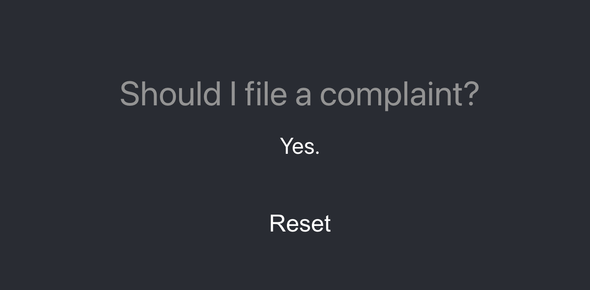
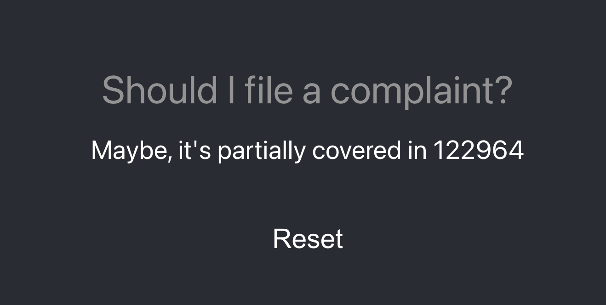
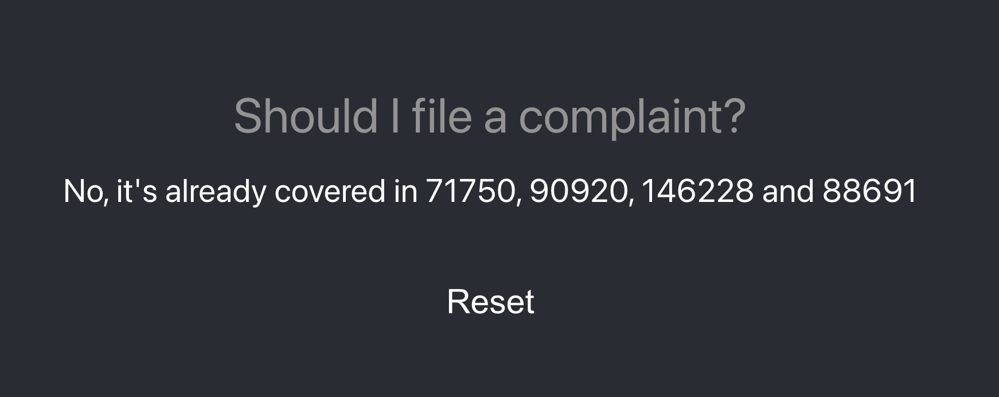

# Should I File a Complaint?

As a product owner, you often encounter situations that demand prioritizing certain bugs while setting aside others. For large-scale, multi-year projects, it can be challenging to discern whether a newly reported issue is indeed novel or if it has been addressed previously. This demo utilizes the newly launched (as of this writing) preview version of vector search support in Azure Cognitive Search in tandem with ChatGPT-4.

Our aim is to employ ChatGPT-4 to determine if a user's error description aligns with a previously solved issue. To do this, we need to equip ChatGPT-4 with a form of "long-term memory" and the capacity to ascertain whether an issue is resolved. Our approach is as follows:
- Long-term memory: We use Azure Cognitive Search Vector support to store all bugs.
- Decision making: We generate a prompt for ChatGPT-4 and provide it with relevant matches from Azure Cognitive Search.

___
## The Results

| Request                                                   | Response                                |
| --------------------------------------------------------- | --------------------------------------- |
| **I can't login using the webpage**                       |      |
| **The customer cant see any data for their new devices**  |  |
| **Website is rendered incorrectly on very small devices** |        |
___

# Resources:
- [Azure Cognative Search Vector example](https://github.com/Azure/cognitive-search-vector-pr/blob/main/docs/vector-search-quickstart.md)
- [OpenAI Embeddings API](https://platform.openai.com/docs/guides/embeddings/what-are-embeddings)
- [OpenAI Chat Compleition API](https://platform.openai.com/docs/guides/gpt/chat-completions-api)

# Code highlights

## Prompting 

We added the following system prompt to use with the compleitions api:

```javascript
export default () => `
    You are a JSON-generator.
    Your mission is to decide if an issue that a user describes has already been registered.

    You will be provided with a list of already reported bugs, if you think that the bug is already
    covered partially or fully by a existing bug you will report it.

    Only output as follows:

    [
        << for each bug that matches >>
        {
            id : "<< id of the bug >>",
            mode : "<< partial (if the bug only partially matches the user's description) or full (if the found bug is already fully covered by the users description) >>"
        }
    ]

    If no matches is found, return [].

    If the user input is clearly not a error description, return: 
    ##ERROR## << some nice text saying that the user must input a valid error description >>
`;

```
The error handling needed to be added since GPT consistently did not respond with JSON if the user entered things like 'I like cows'.
All matches from the vector search was added as assistant messages and finally the raw user query is inserted:

```javascript
const url = 'https://api.openai.com/v1/chat/completions';

    const messages = [{ role: 'system', content: prompt }, ...matches.map(m => {
        return {
            role: 'assistant',
            content: `Id: ${m.id} \n\n${m.content}`
        };
    },

    ), { role: 'user', content: query }];

    ...
}
```

## Searching

The search API in Cognative Service is super simple, the only complicated thing is that we need to create an embedding, and that needs to be done on the same model as we used when inserting data.
I tried for an hour to get the embedding endpoint in the Cognative Service instance to work, but I ended up using the the one in OpenAI's api.

```javascript
export async function search (content: string): Promise<SearchResult[]> {
    const searchVector = await createEmbeddingFromString(content);

    const res = await fetch(`https://${SERVICE_NAME}.search.windows.net/indexes/${INDEX_NAME}/docs/search?api-version=${API_VERSION}`, {
        method: 'POST',
        headers: {
            'Content-Type': 'application/json',
            'api-key': process.env.AZURE_CONGNATIVE_SEARCH_KEY ?? ''
        }, body: JSON.stringify({
            vector: {
                value: searchVector,
                fields: "contentVector",
                k: 5
            },
            select: "title, content, category, id"
        })
    });

    const items = ((await res.json() as any).value as SearchResult[]).filter((i => i["@search.score"] > 0.75));

    return items;
}
```

**createEmbeddingFromString** calls OpenAPI's create embeddings endpoint after first stripping out html-tags and replacing newlines with space (as recommended by the OpenAI docs).

# Notes

The API enabling vector search in Azure Cognitive Services is currently in preview mode and not listed in the portal. For this project, we're utilizing the ChatGPT-4 model for its superiority, but the 3.5 model might perform equivalently.

# Build

Start by creating a .env file and inputting the values corresponding to your own subscriptions:

```bash
OPENAI_API_KEY="Enter your OpenAI subscription key here"
AZURE_DEVOPS_PAT="Azure DevOps Personal Access Token with access to boards"
AZURE_DEVOPS_ORGANISATION="Name of your DevOps organization"
AZURE_DEVOPS_PROJECT="Name of your DevOps project"
AZURE_COGNITIVE_SEARCH_KEY="Subscription key of your Cognitive Search instance"
AZURE_COGNATIVE_SERVICE_NAME="Name of your Cognitive Service"
AZURE_COGNATIVE_INDEX_NAME="Name of your Cognitive Index"
```

Next, execute the following in the root folder:

```
npm run build
```

# Training/Data Vectorization

You must next create vector embeddings for all your Azure DevOps work items:

```bash
npm run import -- Bug 2023-01-01
```

- The first argument can be Bug, User story, Feature, or Epic (supported work item types in Azure DevOps). It will be passed as an argument in a WIQL query when listing all WorkItems.
- The second argument specifies the starting date for importing items.

# Run

To launch the application, execute the following:

```bash
npm start run
```

Open a browser and navigate to [http://127.0.0.1:3000](http://127.0.0.1:3000)

# What's Next

Our current prompt is rather simplistic and offers plenty of opportunities for refinement. Rather than training a model, we plan to explore the potential of a chain of thought approach, providing examples to guide the system's decisions on whether a string matches a work-item or not.

Currently we're not looking into if the WorkItem is closed or not, for how long it has been closed (maybe it needs to be reopened).